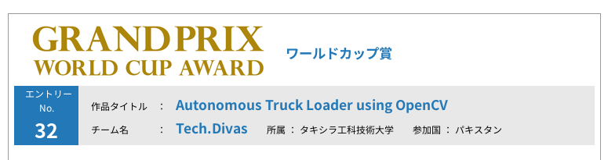
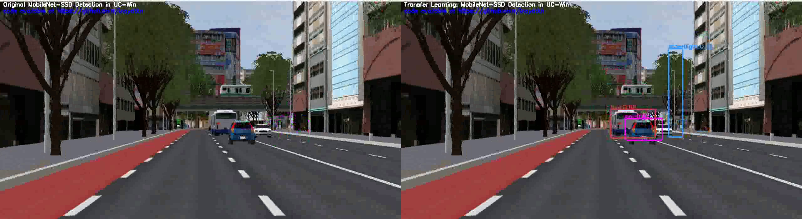
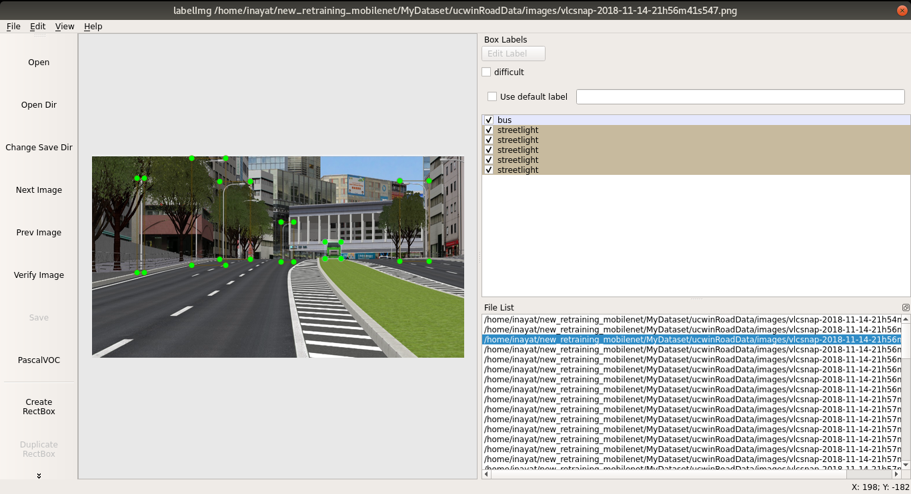

  

# Background

Recently, My team **Tech.Divas** has won a Grand prize Cloud Programming World Cup 2018. Where we used openCV and Deep Learing for various object detection in the UC-Win/Road Virtual Reality based Driving Simulator.

In the project, We have used [MobileNet-SSD](https://github.com/chuanqi305/MobileNet-SSD) for detecting Car, Person, Bikes, Bus using python. Here, we call this model as **standard deep detector**.

During the project work, we have faced few problems while applying the standard deep detector to a UC-WIN/Road simulator scenes:

 - Since the standard deep detector is trained using real world images, we have observed some missing detections some scenes.
 - In addition to the standard deep detector object categories, we also need to detect extra categories such as  street light, and trash bin.
 
We have overcome such problems by using Transfer Learning. I am going to share this code with the opensource python community. **Here, I will write every  step needed for fine tuning the standard deep detector and how to add additional object categories** . Such steps could be applied in any other similar situations.

Before going into details, I would like to share a result before hand as shown bellow:

As we can see in the left side of the above figure, the standard deep dector failed in detecting any object in the scene. **However, my fine-tuned model detects**, results are shown on right side of the above figure, **not only detect car and bus but also an additional object name streetlight**.

# How to train MobileNet-SSD for your Own Object Categories

Here, I  present all the steps needed for the subject.  I give the details in a very easy and straight forward manner.

## Prerequisites
In this tutorial, I will not cover the installation of Caffe-ssd and other prequisites. Such installation tutorials are available online, you need just to Google it. I am using Ubuntu bionic and anaconda with python ver 3.

I presumed that you have dowloaded  [Caffe-SSD](https://github.com/chuanqi305) as:

<pre class="brush: bash; title: ; notranslate" title="">

git clone --branch ssd --depth 1 https://github.com/weiliu89/caffe.git

</pre>

and compiled it properly without errors.

## Step Pre Zero: Collect Taining Images 

It is essential that you have collected images of various object categories for which you want to fine-tune the standard deep detector. It can include images from classes othere than for which the standard deep detector is not even trained.

Here, i have recorded various videos using the UC-Win Road Driving Simulator by setting the interior view of the main driving vehicle camera. Then I have used VLC for extracting images for my training of the MobileNet-SSD detector.

### Step-0:  Prepare the Dataset
First of all create a directory structure or folders as following:

<pre class="brush: bash; title: ; notranslate" title="">

"dataset_name"/
		
		| images/
		
		| labels/
		
		| structure

</pre>

Here my dataset_name= "ucwinRoadData". You should copy all your images collected previously in the images folder of your dataset folder, you have just created.

Now using your favourite text editor, edit [settings-config.ini](settings-config.ini) for setting various paths and variables according to your system. This file is very important, all the paths and parameter values are set once in this file. The scripts in the rest of the steps use this file for reading their required values from this file. 
<pre class="brush: bash; title: ; notranslate" title="">

; settings-config.ini
; This file must be edited for setting various paths accoding your own system paths
[DEFAULT]
dataset_name = ucwinRoadData ; name of your dataset
data_root_dir = /home/inayat/new_retraining_mobilenet/MyDataset ; path to the root folder of your dataset
training_images_base_width = 558

caffessd_root_dir = /home/inayat/new_retraining_mobilenet/caffe

[DEPLOY]
train_iter_model = 45000

</pre>

First of all set the value for **dataset_name** this should the  folder name as explained above. Then set the path value for the **data_root_dir**, which should be the root path value of the folder where you have created your dataset.

The **training_images_base_width** is an important configuration parameter to set. Basically, we need each of our training image size approximately around 200 kilo Bytes. Otherwise, the training will very long time. As we are fine tuning the already trained model for our custom data, therefore I have used CPU only and kepth training_images_base_width to 558. 

Make sure that all images collected and place in right place and are formatted as either .jpg or .png. Finally, run  [00_resizeImagesindataset.py](00_resizeImagesindataset.py ) as follows in your python enviroment:

<pre class="brush: bash; title: ; notranslate" title="">
python 00_resizeImagesindataset.py 
</pre>

Presuming you have install Python ver >= 3 using Anaconda and all the prequistes for [Caffe-SSD](https://github.com/chuanqi305)  are intalled and you have donwloaded it on your system. The **caffessd_root_dir** must be set pointing to the installed directory for

**todo explain caffessd_root_dir **

### Step-1:  Label the Objects in your Dataset

Now, its time to label objects in the dataset by drawing a bounding box around it and name its class. I have used [LabelImg](https://github.com/tzutalin/labelImg) tool. Its very easy to install just run the following command:

<pre class="brush: bash; title: ; notranslate" title="">

pip install labelImg

</pre>

Using the LabelImg GUI, browse the images directory, which were resized in the previous step. Set "Change Save Directory"  in the LabelImg tool to **data_root_dir/dataset_name/labels/**. By pressing Key "W" one can draw a box around any object in the image very easily. After, saving the annotation all the corresponding xml file will be saved in the labels folder. An example is shown bellow:

  

Try to use the same names  for same object class names. Notice that it is necessary to annotate objects in all images. Remove the image if there is no object class is labeled.

Forexample, you can use my dataset **ucwinRoadData** available **here in this repository folder named mydataset**. Download and unzip in your system folder.

### Step-2:  Creating labelmap.prototxt and trainval.txt, test.txt and Files

In this step, I will explain how to create trainval.txt, test.txt, labelmap.prototxt files. These are very essential files to be used in the training process. Make, sure that you have all of your image files in images/ and all of your labels xml in labels/  folders in your **data_root_dir/dataset_name/** folder.

#### labelmap.prototxt
First using your favorite text file editor, we need to create **labelmap.prototxt** in the dataset folder **data_root_dir/dataset_name/**. Depending on the classes in the dataset; for my dataset **ucwinRoadData** this file should look like this 
<pre class="brush: bash; title: ; notranslate" title="">
item {
  name: "none_of_the_above"
  label: 0
  display_name: "background"
}
item {
  name: "car"
  label: 1
  display_name: "car"
}
item {
  name: "bus"
  label: 2
  display_name: "bus"
}
item {
  name: "streetlight"
  label: 3
  display_name: "streetlight"
}

item {
  name: "person"
  label: 4
  display_name: "person"
}

item {
  name: "bike"
  label: 5
  display_name: "bike"
}

</pre>

**Important to note** that the first lable: **none_of_the_above** has to be  as shown above for every dataset5. You need to start your custom labels with  the index number 1. 

#### trainval.txt and test.txt files

Now,  we  have to create files called trainval.txt and test.text in the **data_root_dir/dataset_name/structure/** directory.

These files contains the list of the training and test dataset files names. Here, I am using a very small dataset named "ucwinRoadData". The complete paths should be set  in the **settings-config.ini** files.
Then run the following command for creation of these files:

<pre class="brush: bash; title: ; notranslate" title="">
python 02_createtrainvaldata.py
</pre>

Since my dataset is very small, therefore by default the above script will put all the dataset files both files. However, in generall you should separate your dataset into say 80% training and 20% test files.

## Step-03: Creating LMDB dataset 

Here, we will create the actual LMDB dataset which is to be used by caffe during training on your custom dataset.

<pre class="brush: bash; title: ; notranslate" title="">
./03_create_dataset.sh 
</pre>

This bash script create the following LMDB files and folder on your **data_root_dir** path

<pre class="brush: bash; title: ; notranslate" title="">

"$dataset_name"/
		
		| images/
		
		| labels/
		
		| structure
		
		|"$dataset_name"/lmdb/${dataset_name}_trainval_lmdb  (newly created)
		
		|"$dataset_name"/lmdb/${dataset_name}_test_lmdb (newly created)

</pre>

and some softlinks to these folders in the **examples** folder in the **caffessd_root_dir**

### Create soft-links trainval_lmdb, test_lmdb and labelmap.prototxt in the current directory

In the current folder, create short cuts or soft links, trainval_lmdb  and test_lmdb, by executing the following script: 

<pre class="brush: bash; title: ; notranslate" title="">
./03_2_create_softlinks.sh 
</pre>

## Step-4: Generate prototxt files MobileNetSSD_train.prototxt, MobileNetSSD_test.prototxt, and MobileNetSSD_deploy.prototxt

Now use the **04_gen_model.sh** script to generate the required prototxt files for your own dataset.

This script needs the number of class as argument. **It is important to make sure that you have counted the background as a class**

In my dataset **ucwinData** the total number of classes is 6:

<pre class="brush: bash; title: ; notranslate" title="">
./04_gen_model.sh 6
</pre>

This script will create the following prototxt files in the newly made folder **example**  in the current path:

- MobileNetSSD_train.prototxt
- MobileNetSSD_test.prototxt, and
- MobileNetSSD_deploy.prototxt

## Step-5: Start training the Model using caffe-ssd

This is an important step. Actually all the steps discussed above are settings for this step.  The code script used in this step is shown bellow:
<pre class="brush: bash; title: ; notranslate" title="">
./05_train.sh

#!/bin/sh

caffessd_root_dir=$(./readconfig_ini_file.py settings-config.ini DEFAULT caffessd_root_dir)

$cd $caffessd_root_dir

if ! test -f example/MobileNetSSD_train.prototxt ;then
	echo "error: example/MobileNetSSD_train.prototxt does not exist."
	echo "please use the gen_model.sh to generate your own model."
        exit 1
fi
mkdir -p snapshot
$caffessd_root_dir/build/tools/caffe train -solver="solver_train.prototxt" \
-weights="mobilenet_iter_73000.caffemodel" 
 #-gpu 0 
 
</pre>

The important settings here is the **weights="mobilenet_iter_73000.caffemodel"** parameter passed to the caffe-SSD tain method. You can specify which gpu to use by opening this file and editing the last line.  This step enable you to fine tune the already trained weights **mobilenet_iter_73000.caffemodel** for your own objects dataset. Execute this script as :

<pre class="brush: bash; title: ; notranslate" title="">
./05_train.sh
</pre>

This script will save the caffe model after every 1000 iteration in  the directory named **snapshot**

## Step-6 : After Training, 

When you training is done, it is time to generate the model for deployment. To do that, execute the following

<pre class="brush: bash; title: ; notranslate" title="">
python  06_merge_bn.py
</pre>

It is important to set the value of **train_iter_model** in  file [settings-config.ini](settings-config.ini) in order to specify the iteration number of the trained model to be deployed  already saved in the sanpshot folder. This will create a model in the **deploy** directory.

## Step-7: The Final Step, Use OpenCV for detection in Video

Finally, test your trained model by detecting objects in a video file as :
<pre class="brush: bash; title: ; notranslate" title="">
python 07_video_detection_opencv_ver.py -v ../movs/recording.avi
</pre>

The output of this command will be saved in current folder.

**The test video is provided [here](https://drive.google.com/open?id=1vjVIBjo0C2Rs7VrpSdBdxsH3vCrAX0_x)**.

You can see the results here for my dataset **ucwinRoadData**

and another model for my **Frozen Elsa** dataset. The number of classes were **('background','bigGirl','smallGirl','dog')**

